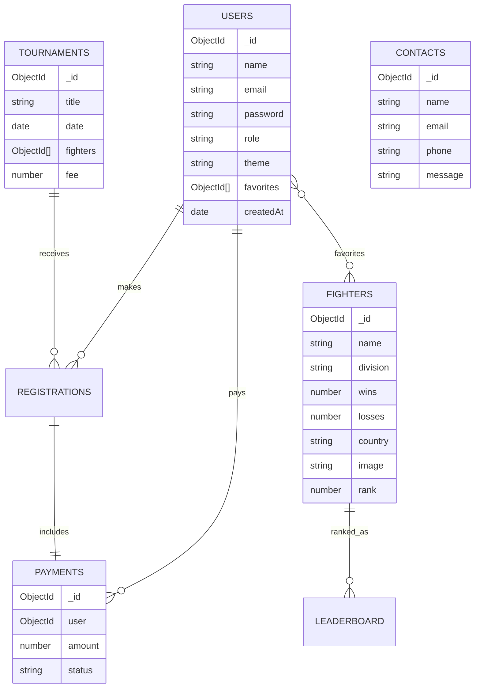

# UFC Nexus — Ultimate Fighting Championship Hub

Full-stack semester/exam project using HTML5, CSS3, modular vanilla JavaScript, Tailwind CDN, GSAP, Node.js, Express, MongoDB/Mongoose, JWT authentication, Express sessions, LocalStorage, SessionStorage, Stripe checkout, Google Maps, CRUD, admin analytics, charts, and deployment-ready structure.

The uploaded UFC screenshot is used only as inspiration for a premium dark sports mood. The layout and code are original.

## Folder structure

```txt
ufc-nexus/
├── frontend/
│   ├── home/index.html home.css home.js
│   ├── players/players.html players.css players.js
│   ├── tournaments/tournaments.html tournaments.css tournaments.js
│   ├── leaderboard/leaderboard.html leaderboard.css leaderboard.js
│   ├── contact/contact.html contact.css contact.js
│   ├── auth/login.html signup.html auth.css auth.js
│   ├── profile/profile.html profile.css profile.js
│   ├── admin/admin.html admin.css admin.js
│   ├── components/navbar.js footer.js loader.js theme.js animations.js api.js base.css
│   └── assets/images/fighters assets/images/logos assets/videos
└── backend/
    ├── server.js
    ├── routes/
    ├── controllers/
    ├── middleware/
    ├── models/
    ├── config/database.js
    ├── seed/seed.js
    └── .env
```

## Database schema / relationships



## API

Base URL: `http://localhost:5000/api`

- `/api/auth` — signup, login, logout, me, forgot password
- `/api/users` — user CRUD and favorites
- `/api/fighters` — fighter CRUD and search/filter/sort
- `/api/events` and `/api/tournaments` — tournament CRUD and registration
- `/api/leaderboard` — rankings CRUD
- `/api/payments` — Stripe checkout, payment confirmation, payment list
- `/api/contact` — contact form CRUD
- `/api/admin` — analytics, activity logs, CSV exports

## Install

```bash
cd backend
npm install
cp .env.example .env
npm run seed
npm run dev
```

Run frontend from another terminal:

```bash
cd frontend
npx serve .
```

Open `http://localhost:3000/home/index.html`.

Demo admin:

```txt
admin@ufcnexus.local
Admin@12345
```

## Environment variables

```env
PORT=5000
MONGO_URI=mongodb://127.0.0.1:27017/ufc-nexus
JWT_SECRET=replace_me
SESSION_SECRET=replace_me
CLIENT_URL=http://localhost:3000
STRIPE_SECRET_KEY=sk_test_replace_me
STRIPE_SUCCESS_URL=http://localhost:3000/tournaments/tournaments.html?payment=success
STRIPE_CANCEL_URL=http://localhost:3000/tournaments/tournaments.html?payment=cancel
GOOGLE_MAPS_API_KEY=replace_me
```

## Deployment

Frontend: deploy `frontend/` separately to Vercel. Backend: deploy `backend/` separately to Render. Database: MongoDB Atlas. Add the deployed backend URL to `frontend/components/api.js` using `window.UFC_NEXUS_API_URL` or `localStorage.setItem("ufc-api-url","https://your-api.onrender.com/api")`.

## Exam feature checklist

- Week 1–4: semantic HTML, CSS layout, JS DOM, form validation.
- Week 5–8: Fetch API, Express routing, MongoDB/Mongoose schemas.
- Week 9–12: JWT, sessions, protected routes, Stripe payments.
- Week 13–16: Google Maps, admin dashboard, deployment, documentation.
- Bonus: fight simulator, loading animation, ticker, achievements, custom cursor, theme modes.
